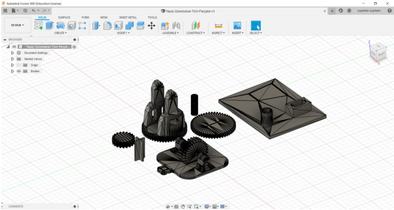
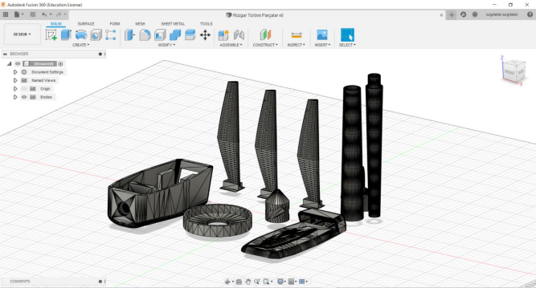
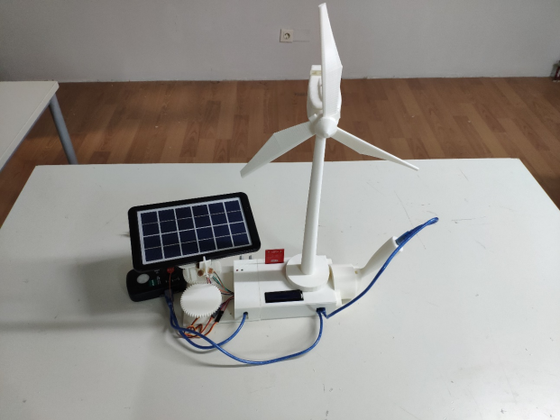
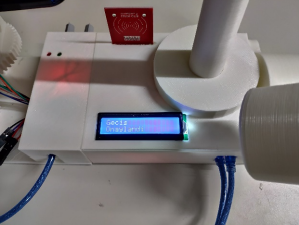
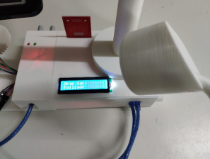

# Autonomous Hybrid (Solar/Wind) EV Charging Station Prototype


##  Project Overview
**Version:** 1.0 (Proof of Concept)
**Status:** Completed

This project is a functional prototype of an **off-grid Electric Vehicle (EV) charging station** powered by hybrid renewable energy sources (Solar & Wind).

The system features an **intelligent Dual-Axis Solar Tracking System** to maximize energy efficiency and an **RFID-based Access Control System** for secure user authentication. It simulates power management and charging cycles using an embedded microcontroller algorithm.

---

##  Key Features

* **Dual-Axis Solar Tracking:** Implemented a **C++ closed-loop control algorithm** that reads data from 4 LDR sensors and adjusts the solar panel angle (Azimuth & Elevation) using servo motors to follow the sun source.
* **RFID Security Integration:** Secured the charging initiation process using an **RC522 RFID module** (SPI Protocol). Only authorized UID cards can activate the system.
* **Energy Simulation:** Since the prototype operates in a demo environment, a software-based **Power Estimation Algorithm** ($P = V \times I$) is implemented to calculate and display simulated Battery Voltage, Current, and Wattage on the LCD.
* **Mechanical Design:** All mechanical parts (Wind turbine blades, gear systems, and chassis) were designed in **Autodesk Fusion 360** and produced via **3D Printing**.

---

##  Gallery & Design

### 1. Mechanical Design (Fusion 360)
*3D modeling of the dual-axis gear mechanism and chassis.*





### 2. System Prototype
*The fully assembled working prototype with dual-axis mechanism and sensors.*







---

##  Hardware & Tech Stack

### Electronics
* **Microcontroller:** Arduino Uno (ATmega328P)
* **Sensors:** 4x Light Dependent Resistors (LDR), Voltage Divider Circuit
* **Communication:** RFID RC522 (SPI Interface), LCD I2C
* **Actuators:** 2x SG90 Servo Motors (Pan/Tilt mechanism)

### Software & Tools
* **Embedded C++** (Firmware development)
* **Autodesk Fusion 360** (CAD/CAM)
* **Fritzing** (Circuit Design)

---

##  Pin Configuration
The firmware is configured with the following pinout (matches the code in `/src`):

| Component | Pin | Function |
| :--- | :--- | :--- |
| **Servo Horizontal** | D5 | PWM Control (Azimuth) |
| **Servo Vertical** | D6 | PWM Control (Elevation) |
| **RFID SDA (SS)** | D10 | SPI Chip Select |
| **RFID RST** | D9 | Reset |
| **Relay** | D4 | Charge Activation |
| **LDR Sensors** | A0-A3 | Light Intensity Input |
| **Voltage Sense** | A4 | Analog Input (0-25V) |

---

##  Installation & Usage

1. **Clone the Repository:**
   ```bash
   git clone [https://github.com/Arda-Semi-Baruh/Hybrid-EV-Charging-Station.git](https://github.com/Arda-Semi-Baruh/Hybrid-EV-Charging-Station.git)
2. **Hardware Setup:** Connect the components according to the Pin Configuration table above.
3. **Upload Firmware:**
   - Open `src/HybridChargingStation.ino` in Arduino IDE.
   - Install required libraries: `MFRC522`, `LiquidCrystal_I2C`, `Servo`.
   - Connect your Arduino and hit **Upload**.
4. **Calibration:** Open Serial Monitor to find your RFID Card UID and update the `authorizedUID` array in the code.

---
##  Author
**Arda Semi Baruh**
*Control and Automation Engineering Student*
[LinkedIn Profile](https://www.linkedin.com/in/arda-şemi-baruh-109b8b313/) | [semibaruh@gmail.com](mailto:semibaruh@gmail.com)
